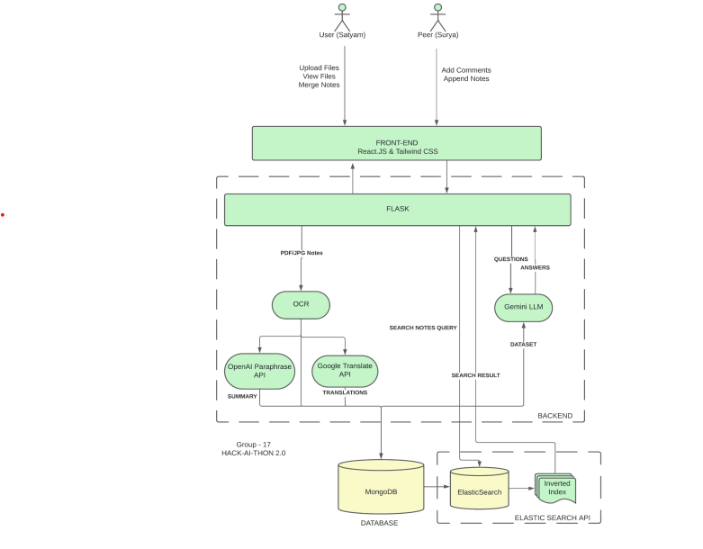

*DocSpot*

Develop a platform for students to upload notes in various formats allowing for easy search and download of the notes uploaded along with AI-driven question answers, enriching students' understanding of the material and facilitating learning. Students working together can increase knowledge gained since students can contribute new notes about what they have learned and is also useful if a student misses any lectures on a topic. The platform merges these notes, allowing all users to access and view them.
Additionally, peers can engage in discussions by adding comments to the notes, suggesting changes, or providing feedback.
Students can easily search for notes according to specific topics thanks to our system's capability to extract key topics from uploaded documents. By analyzing the content, our platform identifies relevant keywords and enables users to search for both keywords and documents effortlessly. Additionally, our platform suggests relevant notes and reference books related to the searched topic, further aiding students in their studies.

The front end of the model is built using the React Next.JS framework and styled with the Tailwind CSS library. The website allows students to upload and view their notes. Peers can access other students' notes and add comments on them. The study materials are uploaded by the user in PDF format and stored on the MongoDB database. The files
undergo OCR to extract words and AI summarization tools are applied to get a summary of the notes for future reference. The uploaded notes can also be translated into multiple languages using the Google Translate API.
To enhance the search performance, ElasticSearch API is used. The backend receives the search query and compares it with the inverted index of the keywords calculated by Elasticsearch. This helps in reducing the search query time, especially for large databases.
The textual data is vector-embedded and the relevant keywords are stored in the database.This allows the implementation of recommendation systems that can suggest similar notes or reference books related to the topic. The knowledge gained by a student can be enriched using automated questions and answers generation with large language models such as Gemini

●Elasticsearch Integration: Configuring and managing Elasticsearch
instances for efficient storage and retrieval of document data. Implementingindexing strategies to optimize search performance and relevance.
● Search Enhancement: Implementing advanced search features such as
fuzzy matching, synonym expansion, and relevance scoring to improve
search accuracy and user experience.
OCR Integration: Implementing optical character recognition (OCR)
technology to extract text from scanned handwritten notes. Utilizing libraries
or APIs such as Tesseract.js or Google Cloud Vision API for accurate text
extraction.
● Text Embedding Generation: Implementing algorithms for generating text
embeddings from the extracted text to facilitate similarity search and
document clustering. Utilizing techniques such as word embeddings (e.g.,
Word2Vec, GloVe) or sentence embeddings (e.g., Universal Sentence
Encoder)

● Vector Database (Pinecone): Implementing and managing the vector
database using Pinecone for efficient storage and retrieval of text
embeddings. Utilizing Pinecone's similarity search capabilities for fast and
accurate similarity queries.
● Chat with Data Feature: Integrating OpenAI/Gemini chat with data from the
vector database using the RAG (Retrieval-Augmented Generation) model.
This involves:
1. Utilizing RAG for retrieving relevant documents based on user queries
within the chat interface.
2. Generating responses that incorporate context from retrieved
documents, providing users with informative and contextually
relevant answers.Implementing seamless integration between
OpenAI/Gemini chat and the vector database, ensuring efficient
retrieval and display of information within the chat interface

To see the working of the website pls check out the youtube link:
https://youtu.be/TNR7ILzWV3E?si=379nZHG9LPEpDKuu